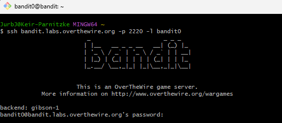
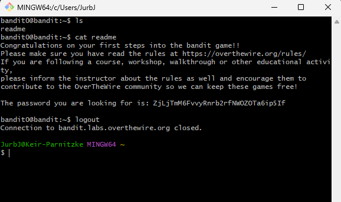

# Bandit Level 0 → Level 1
## Goal
The password for the next level is stored in a file called readme located in the home directory.

## Commands Used and What They Do
- `ls`: Lists files and directories in the current directory.
- `cat`: Displays the contents of a file.
---
## Steps Taken
1. **Once logged in, list the contents of the current directory:**
   ```bash
   ls
   ```

2. **You should see a file named readme. Read its contents:**
   ```bash
   cat readme
   ```

3. **Copy the password that appears:**
   ```
   ZjLjTmM6FvvyRnrb2rfNWOZOTa6ip5If
   ```

## Screenshots
*Initial login and directory listing*



*Reading the readme file and obtaining the password*



This password will be used to log into Level 1. Remember to save it.
