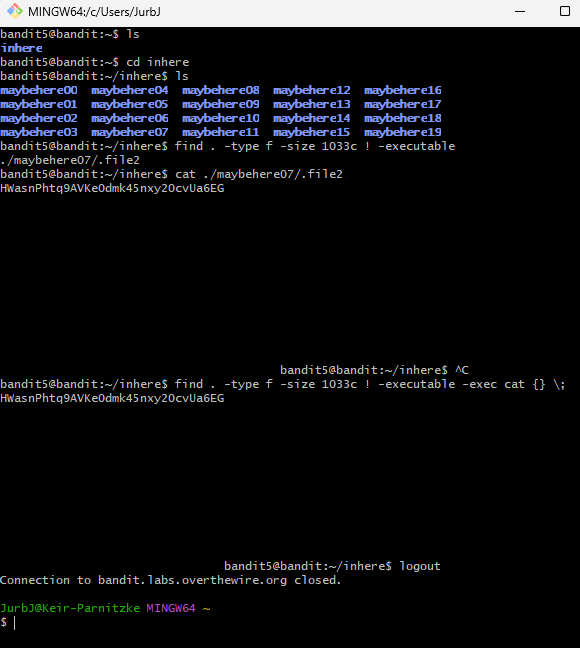

# Bandit Level 5 → Level 6
## Goal
The password for the next level is stored in a file somewhere under the inhere directory and has all of the following properties:
- human-readable
- 1033 bytes in size
- not executable
---
## Commands Used and What They Do
- `ls`: Lists files and directories in the current directory.
- `cd`: Changes directory.
- `find`: Searches for files and directories based on various criteria.
- `cat`: Displays the contents of a file.
---
## Steps Taken
1. **Once logged in, list the contents of the current directory:**
   ```bash
   ls
   ```

2. **Change into the inhere directory:**
   ```bash
   cd inhere
   ```

3. **List the contents to see the directory structure:**
   ```bash
   ls
   ```
   **You'll see multiple subdirectories (maybehere00, maybehere01, etc.)**

4. **Use find to locate the file with the specified properties:**
   ```bash
   find . -type f -size 1033c ! -executable
   ```

5. **The command should return a single file path. Read its contents:**
   ```bash
   cat ./maybehere07/.file2
   ```

6. **Copy the password that appears:**
   ```
   P4L4vucdmLnm8I7Vl7jG1ApGSfjYKqJU
   ```

   ## Screenshots





This password will be used to log into Level 6. Remember to save it.

---
## Best Method
**The most efficient way to solve this level:**
```bash
find . -type f -size 1033c ! -executable -exec cat {} \;
```
**Why this works better:**
- Combines the search and display into one command
- `-type f` finds only files (not directories)
- `-size 1033c` finds files exactly 1033 bytes in size
- `! -executable` finds non-executable files
- `-exec cat {} \;` automatically displays the content of the found file
