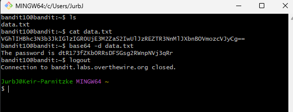

# Bandit Level 10 → Level 11
## Goal
The password for the next level is stored in the file data.txt, which contains base64 encoded data.

## Commands Used and What They Do
- `cat`: Displays the contents of a file.
- `base64`: Encodes or decodes base64 data.
- `base64 -d`: Decodes base64 encoded data back to its original form.
---
## Steps Taken
1. **Look at the contents of data.txt:**
   ```bash
   cat data.txt
   ```
   You'll see a string that looks like base64 encoded data (contains letters, numbers, and possibly + / = characters).

2. **Decode the base64 data:**
   ```bash
   base64 -d data.txt
   ```

3. **The output should show:**
   ```
   The password is 6zPeziLdR2RKNdNYFNb6nVCKzphlXHBM
   ```

4. **Copy the password:**
   ```
   6zPeziLdR2RKNdNYFNb6nVCKzphlXHBM
   ```

## Screenshots





   

This password will be used to log into Level 11. Remember to save it.

---
## Understanding Base64 Encoding
**What base64 is:**
- Base64 is a way to encode binary data into ASCII text using only 64 characters (A-Z, a-z, 0-9, +, /)
- It's commonly used to transmit binary data over text-based protocols like email
- Base64 encoded strings often end with one or two `=` characters as padding
- The `-d` flag tells the base64 command to decode (rather than encode) the input
