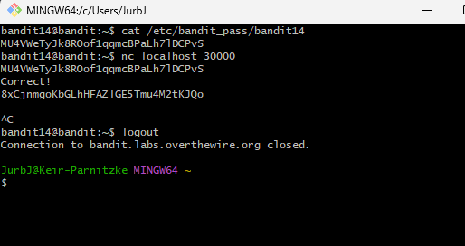

# Bandit Level 14 → Level 15
## Goal
The password for the next level can be retrieved by submitting the password of the current level to port 30000 on localhost.

## Commands Used and What They Do
- `cat`: Displays the contents of a file.
- `nc` (netcat): Network utility for reading from and writing to network connections.
- `telnet`: Another network utility for connecting to remote hosts.
---
## Steps Taken
1. **Get the current level's password:**
   ```bash
   cat /etc/bandit_pass/bandit14
   ```
   This shows: `fGrHPx402xGC7U7rXKDaxiWFTOiF0ENq`

2. **Connect to localhost port 30000 using netcat:**
   ```bash
   nc localhost 30000
   ```

3. **Type or paste the current password and press Enter:**
   ```
   fGrHPx402xGC7U7rXKDaxiWFTOiF0ENq
   ```

4. **The server should respond with:**
   ```
   Correct!
   jN2kgmIXJ6fShzhT2avhotn4Zcka6tnt
   ```

5. **Copy the password:**
   ```
   jN2kgmIXJ6fShzhT2avhotn4Zcka6tnt
   ```
## Screenshots

   

   

This password will be used to log into Level 15. Remember to save it.

---
## Understanding Network Services
**Key concepts:**
- **localhost**: Refers to the local machine (IP address 127.0.0.1)
- **Port numbers**: Identify specific services running on a host (like 30000 in this case)
- **netcat (nc)**: Swiss army knife for network connections - can connect to any TCP/UDP port
- **Client-server communication**: Your terminal acts as a client connecting to a service on port 30000
- This demonstrates how many services work: send a request, receive a response
