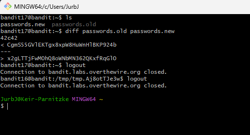

# Bandit Level 17 → Level 18
## Goal
There are 2 files in the homedirectory: passwords.old and passwords.new. The password for the next level is in passwords.new and is the only line that has been changed between passwords.old and passwords.new.

## Commands Used and What They Do
- `ls`: Lists files and directories in the current directory.
- `diff`: Compares files line by line and shows differences.
- `cat`: Displays the contents of a file.
---
## Steps Taken
1. **List the files in the home directory:**
   ```bash
   ls
   ```
   You should see `passwords.old` and `passwords.new`.

2. **Compare the two files to find the difference:**
   ```bash
   diff passwords.old passwords.new
   ```

3. **The output should show something like:**
   ```
   42c42
   < w0Yfolrc5bwjS4qw5mq1nnQi6mF03bii
   ---
   > hga5tuuCLF6fFzUpnagiMN8ssu9LFrdg
   ```

4. **The line after `>` is the new password. Copy it:**
   ```
   hga5tuuCLF6fFzUpnagiMN8ssu9LFrdg
   ```

## Screenshots

   


This password will be used to log into Level 18. Remember to save it.

---
## Understanding diff Command
**How diff output works:**
- **Lines with `<`**: Content from the first file (passwords.old)
- **Lines with `>`**: Content from the second file (passwords.new)
- **Line numbers**: `42c42` means line 42 was changed in both files
- **Common diff symbols**:
  - `c` = changed line
  - `a` = added line  
  - `d` = deleted line
- The `diff` command is essential for version control, file comparison, and spotting changes in configuration files
