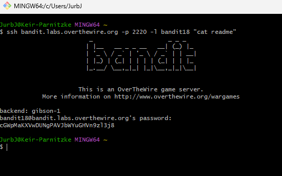

# Bandit Level 18 → Level 19
## Goal
The password for the next level is stored in a file readme in the homedirectory. However, someone has modified .bashrc to log you out when you log in with SSH.

## Commands Used and What They Do
- `ssh`: Secure Shell for remote login.
- `ssh -t`: Forces pseudo-terminal allocation.
- `cat`: Displays the contents of a file.
---
## Steps Taken
1. **Try to log in normally (this will immediately log you out):**
   ```bash
   ssh bandit18@bandit.labs.overthewire.org -p 2220
   ```
   You'll be logged out immediately due to the modified .bashrc.

2. **Bypass the .bashrc by executing a command directly via SSH:**
   ```bash
   ssh bandit18@bandit.labs.overthewire.org -p 2220 "cat readme"
   ```

3. **Enter the password when prompted:**
   ```
   hga5tuuCLF6fFzUpnagiMN8ssu9LFrdg
   ```

4. **The command will execute and display the password:**
   ```
   awhqfNnAbc1naukrpqDYcF95h7HoMTrC
   ```

5. **Copy the password:**
   ```
   awhqfNnAbc1naukrpqDYcF95h7HoMTrC
   ```

   ## Screenshots

   
   

This password will be used to log into Level 19. Remember to save it.

---
## Understanding SSH Command Execution
**Key concepts:**
- **Remote command execution**: SSH can execute commands on remote hosts without starting an interactive shell
- **.bashrc modification**: The .bashrc file contains a command that logs you out immediately
- **Bypassing shell startup files**: By executing commands directly, we avoid loading .bashrc
- **SSH syntax**: `ssh user@host "command"` runs the command and returns the output
- **Security implications**: This technique shows how shell restrictions can sometimes be bypassed
- Similar techniques work for other restrictive shell environments
